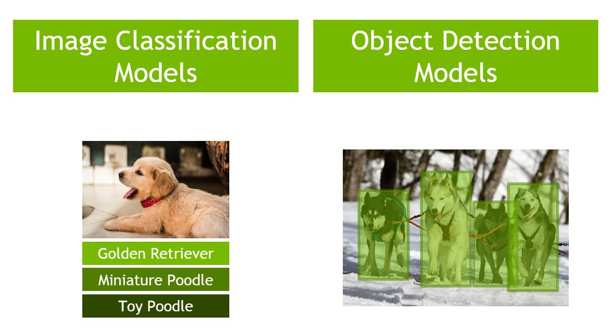
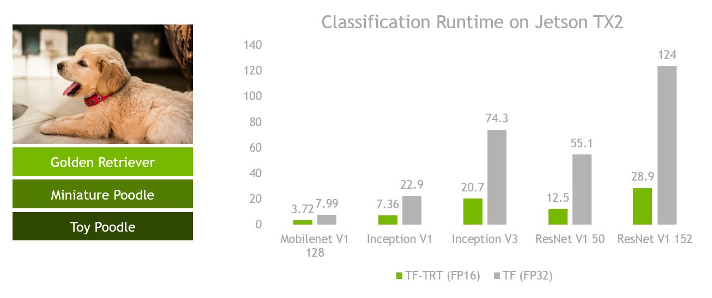
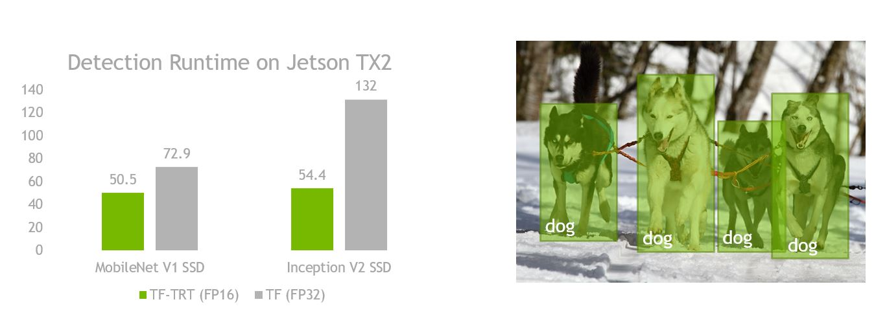

TensorFlow/TensorRT Models on Jetson
====================================

<p align="center">

</p>

This repository contains scripts and documentation to use TensorFlow image classification and object detection models on NVIDIA Jetson.  The models are sourced from the [TensorFlow models repository](https://github.com/tensorflow/models)
and optimized using TensorRT.

* [Setup](#setup)
* [Image Classification](#ic)
  * [Models](#ic_models)
  * [Download pretrained model](#ic_download)
  * [Build TensorRT / Jetson compatible graph](#ic_build)
  * [Optimize with TensorRT](#ic_trt)
  * [Jupyter Notebook Sample](#ic_notebook)
  * [Train for custom task](#ic_train)
* [Object Detection](#od)
  * [Models](#od_models)
  * [Download pretrained model](#od_download)
  * [Build TensorRT / Jetson compatible graph](#od_build)
  * [Optimize with TensorRT](#od_trt)
  * [Jupyter Notebook Sample](#od_notebook)
  * [Train for custom task](#od_train)

<a name="setup"></a>
Setup
-----

1. Flash your Jetson TX2 with JetPack 3.2 (including TensorRT).
2. Install miscellaneous dependencies on Jetson

   ```
   sudo apt-get install python-pip python-matplotlib python-pil
   ```
   
3. Install TensorFlow 1.7+ (with TensorRT support).  Download the [pre-built pip wheel](https://devtalk.nvidia.com/default/topic/1031300/jetson-tx2/tensorflow-1-8-wheel-with-jetpack-3-2-/) and install using pip.

    ```
    pip install tensorflow-1.8.0-cp27-cp27mu-linux_aarch64.whl --user
    ```
    
    or if you're using Python 3.
    
    ```
    pip3 install tensorflow-1.8.0-cp35-cp35m-linux_aarch64.whl --user
    ```

    
4. Clone this repository

    ```
    git clone --recursive https://github.com/NVIDIA-Jetson/tf_trt_models.git
    cd tf_trt_models
    ```

5. Run the installation script

    ```
    ./install.sh
    ```
    
    or if you want to specify python intepreter
    
    ```
    ./install.sh python3
    ```

<a name="ic"></a>
Image Classification
--------------------





<a name="ic_models"></a>
### Models

| Model | Input Size | TF-TRT TX2 | TF TX2 |
|:------|:----------:|-----------:|-------:|
| inception_v1 | 224x224 | 7.36ms | 22.9ms |
| inception_v2 | 224x224 | 9.08ms | 31.8ms |
| inception_v3 | 299x299 | 20.7ms | 74.3ms |
| inception_v4 | 299x299 | 38.5ms | 129ms  |
| inception_resnet_v2 | 299x299 |   | 158ms |
| resnet_v1_50 | 224x224 | 12.5ms | 55.1ms |
| resnet_v1_101 | 224x224 | 20.6ms | 91.0ms |
| resnet_v1_152 | 224x224 | 28.9ms | 124ms |
| resnet_v2_50 | 299x299 | 26.5ms | 73.4ms |
| resnet_v2_101 | 299x299 | 46.9ms |    |
| resnet_v2_152 | 299x299 | 69.0ms |    |
| mobilenet_v1_0p25_128 | 128x128 | 3.72ms | 7.99ms |
| mobilenet_v1_0p5_160 | 160x160 | 4.47ms | 8.69ms |
| mobilenet_v1_1p0_224 | 224x224 | 11.1ms | 17.3ms |

**TF** - Original TensorFlow graph (FP32)

**TF-TRT** - TensorRT optimized graph (FP16)

The above benchmark timings were gathered after placing the Jetson TX2 in MAX-N
mode.  To do this, run the following commands in a terminal:

```
sudo nvpmodel -m 0
sudo ~/jetson_clocks.sh
```

<a name="ic_download"></a>
### Download pretrained model

As a convenience, we provide a script to download pretrained models sourced from the
TensorFlow models repository.  

```python
from tf_trt_models.classification import download_classification_checkpoint

checkpoint_path = download_classification_checkpoint('inception_v2')
```
To manually download the pretrained models, follow the links [here](https://github.com/tensorflow/models/tree/master/research/slim#Pretrained).

<a name="ic_build"></a>

### Build TensorRT / Jetson compatible graph

```python
from tf_trt_models.classification import build_classification_graph

frozen_graph, input_names, output_names = build_classification_graph(
    model='inception_v2',
    checkpoint=checkpoint_path,
    num_classes=1001
)
```

### Optimize with TensorRT

```python
import tensorflow.contrib.tensorrt as trt

trt_graph = trt.create_inference_graph(
    input_graph_def=frozen_graph,
    outputs=output_names,
    max_batch_size=1,
    max_workspace_size_bytes=1 << 25,
    precision_mode='FP16',
    minimum_segment_size=50
)
```

<a name="ic_notebook"></a>
### Jupyter Notebook Sample

For a comprehensive example of performing the above steps and executing on a real
image, see the [jupyter notebook sample](examples/classification/classification.ipynb).

<a name="ic_train"></a>
### Train for custom task

Follow the documentation from the [TensorFlow models repository](https://github.com/tensorflow/models/tree/master/research/slim).
Once you have obtained a checkpoint, proceed with building the graph and optimizing
with TensorRT as shown above.

<a name="od"></a>
Object Detection 
----------------



<a name="od_models"></a>
### Models

| Model | Input Size | TF-TRT TX2 | TF TX2 |
|:------|:----------:|-----------:|-------:|
| ssd_mobilenet_v1_coco | 300x300 | 50.5ms | 72.9ms |
| ssd_inception_v2_coco | 300x300 | 54.4ms | 132ms  |

**TF** - Original TensorFlow graph (FP32)

**TF-TRT** - TensorRT optimized graph (FP16)

The above benchmark timings were gathered after placing the Jetson TX2 in MAX-N
mode.  To do this, run the following commands in a terminal:

```
sudo nvpmodel -m 0
sudo ~/jetson_clocks.sh
```

<a name="od_download"></a>
### Download pretrained model

As a convenience, we provide a script to download pretrained model weights and config files sourced from the
TensorFlow models repository.  

```python
from tf_trt_models.detection import download_detection_model

config_path, checkpoint_path = download_detection_model('ssd_inception_v2_coco')
```
To manually download the pretrained models, follow the links [here](https://github.com/tensorflow/models/blob/master/research/object_detection/g3doc/detection_model_zoo.md).

> **Important:** Some of the object detection configuration files have a very low non-maximum suppression score threshold (ie. 1e-8).
> This can cause unnecessarily large CPU post-processing load.  Depending on your application, it may be advisable to raise 
> this value to something larger (like 0.3) for improved performance.  We do this for the above benchmark timings.  This can be done by modifying the configuration
> file directly before calling build_detection_graph.  The parameter can be found for example in this [line](https://github.com/tensorflow/models/blob/master/research/object_detection/samples/configs/ssd_mobilenet_v1_coco.config#L130).

<a name="od_build"></a>
### Build TensorRT / Jetson compatible graph

```python
from tf_trt_models.detection import build_detection_graph

frozen_graph, input_names, output_names = build_detection_graph(
    config=config_path,
    checkpoint=checkpoint_path
)
```

<a name="od_trt"></a>
### Optimize with TensorRT

```python
import tensorflow.contrib.tensorrt as trt

trt_graph = trt.create_inference_graph(
    input_graph_def=frozen_graph,
    outputs=output_names,
    max_batch_size=1,
    max_workspace_size_bytes=1 << 25,
    precision_mode='FP16',
    minimum_segment_size=50
)
```

<a name="od_notebook"></a>
### Jupyter Notebook Sample

For a comprehensive example of performing the above steps and executing on a real
image, see the [jupyter notebook sample](examples/detection/detection.ipynb).

<a name="od_train"></a>
### Train for custom task

Follow the documentation from the [TensorFlow models repository](https://github.com/tensorflow/models/tree/master/research/object_detection).
Once you have obtained a checkpoint, proceed with building the graph and optimizing
with TensorRT as shown above.  Please note that all models are not tested so 
you should use an object detection
config file during training that resembles one of the ssd_mobilenet_v1_coco or
ssd_inception_v2_coco models.  Some config parameters may be modified, such as the number of
classes, image size, non-max supression parameters, but the performance may vary.
